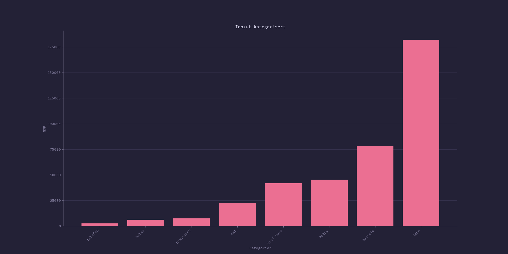
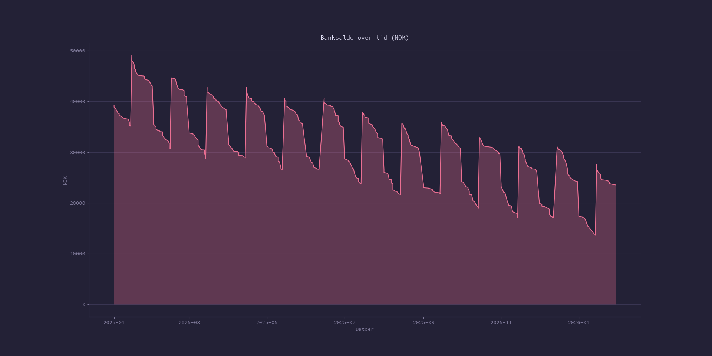
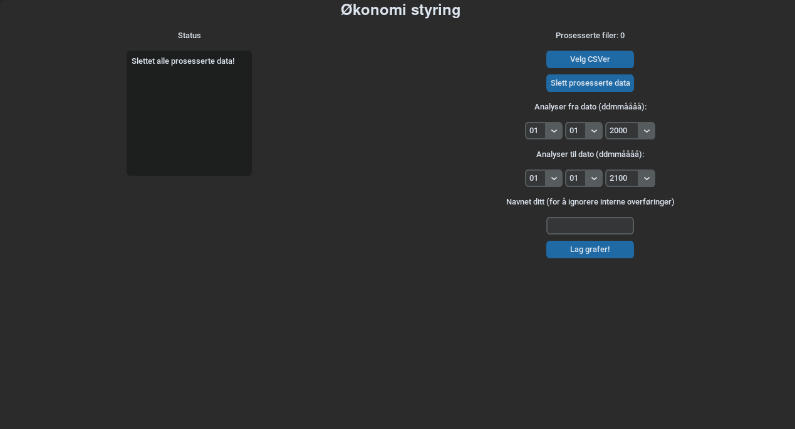

# Økonomi-oversikt
Få oversikt over økonomien din

Dette er bare et lite hobbyprosjekt jeg har for å få oversikt over saldo over ting, samt hva jeg faktisk bruker pengene mine på. Man kan kjøre `main.py` for å starte programmet. Dette programmet er mest tilrettelagt Eika sine CSV-filer, men man kan modifisere koden til å tilrettelegge for andre banker dersom man vil. 

## Hvordan få tak i CSV-filene? 
1. Gå inn på banken
2. Gå inn på transaksjonsoversikten
3. Trykk på nedlastningsknappen (ofte et symbol)
4. Velg "csv-format" eller noe lignene, og last ned

## Hvordan kjøre programmet? 
1. Installer Python [her](https://www.python.org/)
2. Kjør `python install -r requirements.txt` i terminalen i denne mappen
3. Kjør `main.py` filen med Python

Generelle unådde mål: 
- Lage en struktur hvor du kan lagre alt du har gjort i et "prosjekt", og åpne det senere
- Legg til prosent oversikt
- Sørge for at samme periode på samme konto ikke blir lest 2 ganger selv om det er forskjellige dokumenter
- Lage bedre oversikt over leste dokumenter og periodene deres
- Støtte andre skriftspråk?

## Annerkjennelser:
Takk til alle som har skrevet biblioteken jeg har brukt i dette prosjektet. Spesielt takk til [h4pZ](https://github.com/h4pZ/rose-pine-matplotlib) for å gitt et pyplot tema som gjør grafene mine litt penere.